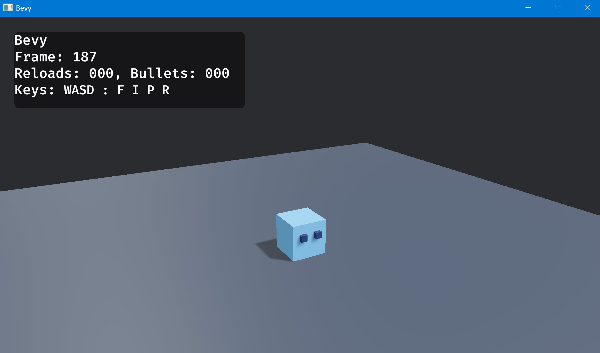
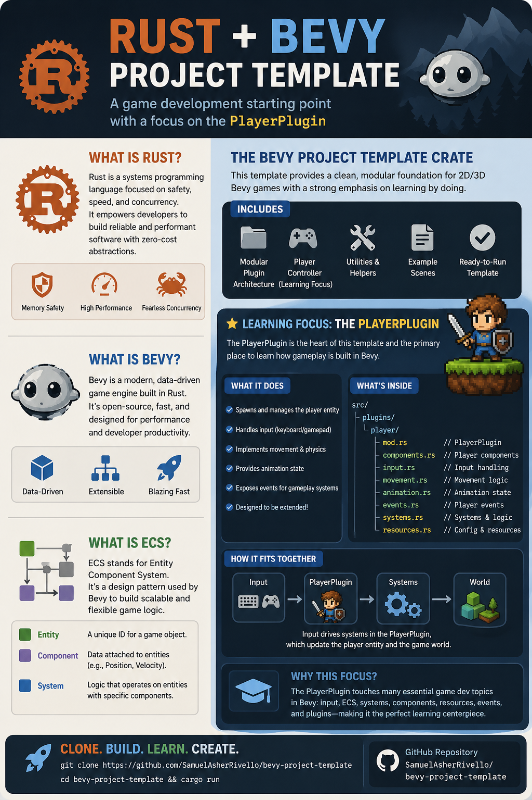

# Bevy Project Template

Bevy project template with hot reload.

## Features

* Bevy game structure with best practices
* Optimized project compile times for full build
* Optimized sub-second hot reload times 
* Targets: Windows 11 Native (With hot reload) 
* Targets: Web Browser WASM (Without hot reload)

## Pics

### Screenshot

### InfoGraphic

## Setup

### IDE Setup

You can use any IDE, but here is the VS Code setup:

1. Download [VSCode](https://code.visualstudio.com/)
2. Open [VSCode](https://code.visualstudio.com/docs)
3. Open [this repository folder](./)
4. Add [rust-analyzer extension for VSCode](https://marketplace.visualstudio.com/items?itemName=rust-lang.rust-analyzer)

### AI Setup

These steps are optional

* Download the [`Codex CLI`](https://www.codex.com/)
* Download the [`Codex App`](https://www.codex.com/)
* Add [Codex extension for VSCode](https://developers.openai.com/codex/ide)
* Login to Codex via OpenAI [(Free is ok. Plus/Pro Recommended)](https://chatgpt.com/pricing/)

### Project Setup

These steps are required

1. Run common scripts below
2. Try hot reload. While app running, open `Bevy/Crates/Game/Runtime/Systems/PlayerSystem.rs`, edit line 15 (`const PLAYER_THRUST_FORCE: f32 = 20.0;`), and save.

## Scripts

### Common

| # | Script | Platform | Required? | Use |
| -- | ------ | -------- | --------- | --- |
| 01 | [`InstallDependencies.ps1`](./Scripts/Common/InstallDependencies.ps1) | Windows | ✅ | First-time setup and validation build. |
| 02 | [`RunGameWithHotReload.ps1`](./Scripts/Common/RunGameWithHotReload.ps1) | Windows | ✅ | Build and run the active game with hot reload. |

### Other

| # | Script | Platform | Required? | Use |
| -- | ------ | -------- | --------- | --- |
| 03 | [`BuildGameCrate.ps1`](./Scripts/Other/BuildGameCrate.ps1) | Windows | ❌ | Build the active game crate without running it. |
| 04 | [`BuildSharedCrate.ps1`](./Scripts/Other/BuildSharedCrate.ps1) | Windows | ❌ | Build the shared crate without running the game. |
| 05 | [`DebugHotReloadAttributeCount.ps1`](./Scripts/Other/DebugHotReloadAttributeCount.ps1) | Windows | ❌ | Count hot-reload attributes for debugging. |
| 06 | [`RunGame.ps1`](./Scripts/Other/RunGame.ps1) | Windows | ❌ | Build and run the active game without hot reload. |
| 07 | [`RunGameWeb.ps1`](./Scripts/Other/RunGameWeb.ps1) | Windows | ❌ | Build and run the game in browser/wasm without hot reload. |
| 08 | [`RunTestsGame.ps1`](./Scripts/Other/RunTestsGame.ps1) | Windows | ❌ | Run the game test suite. |
| 09 | [`RunTestsShared.ps1`](./Scripts/Other/RunTestsShared.ps1) | Windows | ❌ | Run shared crate tests. |
| 10 | [`StopGame.ps1`](./Scripts/Other/StopGame.ps1) | Windows | ❌ | Stop running game processes. |

## Structure

### Crates

The workspace has 2 active crates: `game` and `shared`.

| Path | Description |
| ---- | ----------- |
| [`Bevy/Crates/Game`](./Bevy/Crates/Game) | Active Cargo package for the game |
| [`Bevy/Crates/Shared`](./Bevy/Crates/Shared) | Shared runtime code and vendored support dependencies |

### Details

| Path | Description |
| ---- | ----------- |
| [`Bevy/Crates/Game/Assets`](./Bevy/Crates/Game/Assets) | Game assets |
| [`Bevy/Crates/Game/Runtime/Components`](./Bevy/Crates/Game/Runtime/Components) | Bevy component types |
| [`Bevy/Crates/Game/Runtime/Plugins`](./Bevy/Crates/Game/Runtime/Plugins) | Bevy plugin wiring |
| [`Bevy/Crates/Game/Runtime/Resources`](./Bevy/Crates/Game/Runtime/Resources) | Bevy resource types |
| [`Bevy/Crates/Game/Runtime/Systems`](./Bevy/Crates/Game/Runtime/Systems) | Startup and update systems |
| [`Bevy/Crates/Game/Tests`](./Bevy/Crates/Game/Tests) | Unit tests for game behavior |
| [`Bevy/Crates/Shared/Runtime/3rdParty/bevy_simple_subsecond_system`](./Bevy/Crates/Shared/Runtime/3rdParty/bevy_simple_subsecond_system) | Vendored hot-reload support crate |

## HotKeys

### Terminal

| Key | Use |
| --- | --- |
| `ctrl+c` | Exit the server |
| `r` | Rebuild the app by relaunching the previous compile. This does not recompile Rust code. |
| `p` | Toggle automatic rebuilds |
| `v` | Toggle verbose logging |
| `/` | Show more commands and shortcuts |

### Runtime

| Key | Use | Toggle? |
| --- | --- | --- |
| `W` | Thrust forward | ❌ |
| `A` | Turn left | ❌ |
| `S` | Shoot | ❌ |
| `D` | Turn right | ❌ |
| `F` | Show or hide FPS | ✅ |
| `I` | Show or hide Bevy Inspector | ✅ |
| `P` | Switch bullet physics mode | ✅ |
| `R` | Reset player | ❌ |

---

## Suggested Next Steps

Learn Bevy by extending this project with new features. Here are some ideas.

| # | Title | Description | Link |
| -- | ----- | ----------- | ---- |
| 1 | 3DModel | Replace the player cube with a 3D model. | [Bevy glTF examples](https://bevy.org/examples/#gltf) |
| 2 | Infinite Scroll | Replace the floor with a large textured world and lock the camera to the player. | [Bevy top-down camera](https://bevy.org/examples/camera/2d-top-down-camera/) |
| 3 | Enemies | Spawn an enemy every X seconds and make bullets hit enemies. | [Avian collision detection](https://docs.rs/avian3d/latest/avian3d/collision/index.html) |
| 4 | Game UI | Add health, score, ammo, and wave counters to the screen. | [Bevy UI examples](https://bevy.org/examples/#ui-user-interface) |
| 5 | Audio Effects | Add firing, impact, and enemy-hit sounds. | [Bevy audio examples](https://bevy.org/examples/#audio) |
| 6 | Mini Map | Add a small top-down camera view so players can see nearby world space. | [Bevy Cheat Book (Cameras)](https://bevy-cheatbook.github.io/graphics/camera.html) |

## Resources

| Resource | Link |
| -------- | ---- |
| Avian Physics | [`avian`](https://github.com/Jondolf/avian) |
| Create & Move Entity In Bevy (Beginner) | [`Examples/transforms`](https://bevy.org/examples/transforms/translation/) |
| Hot Reload System (Advanced) | [`bevy_simple_subsecond_system`](https://crates.io/crates/bevy_simple_subsecond_system) |

---

## Credits

**Created By**

- Samuel Asher Rivello
- Over 25 years XP with game development (2025)
- Over 10 years XP with Unity (2025)

**Contact**

- Twitter - [@srivello](https://twitter.com/srivello)
- Git - [Github.com/SamuelAsherRivello](https://github.com/SamuelAsherRivello)
- Resume & Portfolio - [SamuelAsherRivello.com](https://www.SamuelAsherRivello.com)
- LinkedIn - [Linkedin.com/in/SamuelAsherRivello](https://www.linkedin.com/in/SamuelAsherRivello)

**License**

Provided as-is under [MIT License](./LICENSE) | Copyright ™ & © 2006 - 2026 Rivello Multimedia Consulting, LLC
